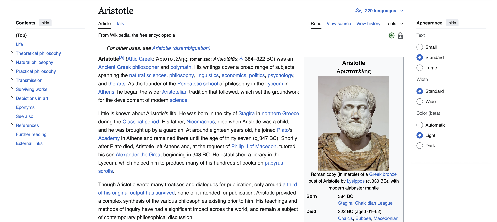
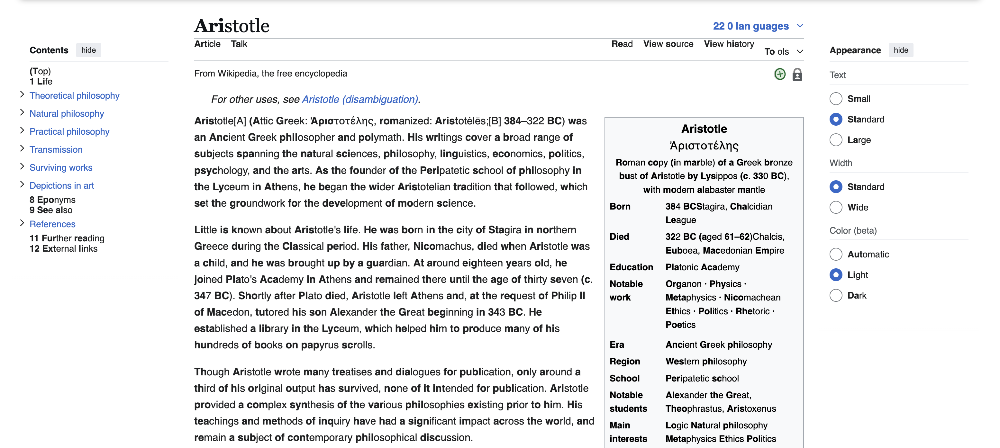
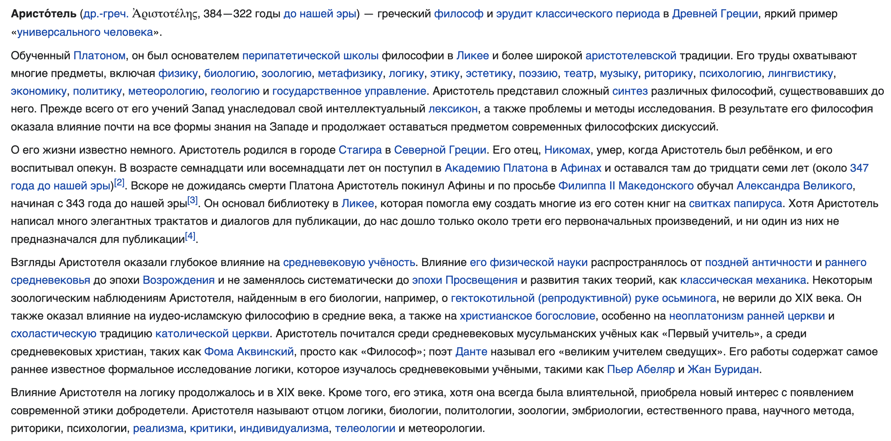
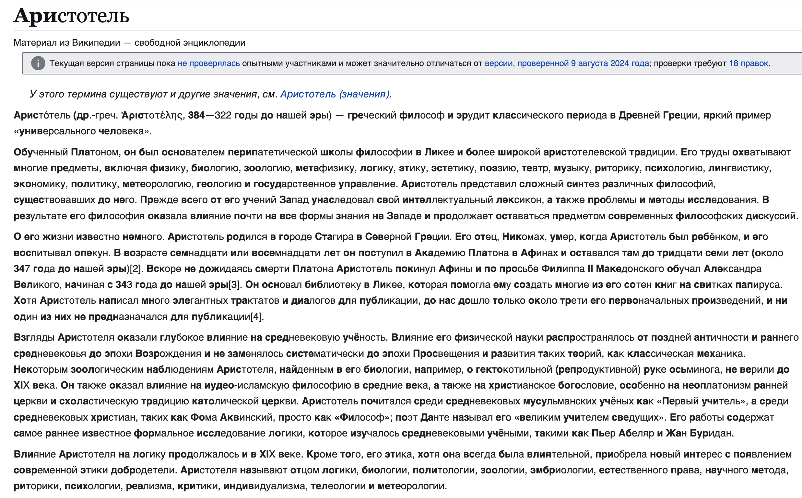
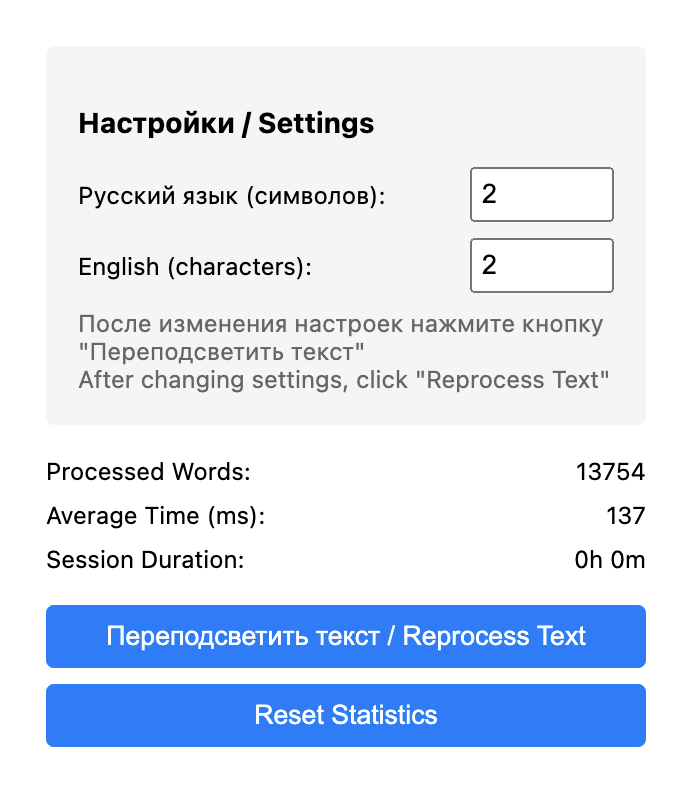

# Chrome Bionic Reader

[](./coverage/lcov-report/index.html)
[](https://github.com/the-homeless-god/chrome-bionic-reader/actions/workflows/ci.yml)
[](https://prettier.io/)

## Documentation | Документация

- [English Documentation](./docs/en/README.md)
- [Русская Документация](./docs/ru/README.md)

## Key Features | Ключевые особенности

- Functional Programming style | Функциональный стиль программирования
- >80% test coverage | >80% покрытие тестами
- Russian language support | Поддержка русского языка
- Automatic publishing | Автоматическая публикация
- Clean architecture | Чистая архитектура
- Adaptive word highlighting | Адаптивное выделение слов
- Flexible language settings | Гибкие настройки для каждого языка
- Real-time statistics | Статистика в реальном времени

## Examples | Примеры
### English Text | Английский текст

| Normal | Bionic |
|--------|---------|
|  |  |

### Russian Text | Русский текст

| Normal | Bionic |
|--------|---------|
|  |  |

### Settings | Настройки


## Installation | Установка

You can install the extension in two ways | Вы можете установить расширение двумя способами:

### Chrome Web Store | Магазин Chrome

Install directly from [Chrome Web Store](https://chromewebstore.google.com/detail/chrome-bionic-reader/bofckkbophijgakfoeihfmnjfphcabhi)

Установите напрямую из [Chrome Web Store](https://chromewebstore.google.com/detail/chrome-bionic-reader/bofckkbophijgakfoeihfmnjfphcabhi)

### Manual Installation | Ручная установка

1. Download the latest release from [Releases page](https://github.com/the-homeless-god/chrome-bionic-reader/releases/latest)
2. Unzip the downloaded file
3. Open Chrome and go to `chrome://extensions/`
4. Enable "Developer mode"
5. Click "Load unpacked" and select the unzipped folder

1. Скачайте последний релиз со [страницы релизов](https://github.com/the-homeless-god/chrome-bionic-reader/releases/latest)
2. Распакуйте скачанный файл
3. Откройте Chrome и перейдите на `chrome://extensions/`
4. Включите "Режим разработчика"
5. Нажмите "Загрузить распакованное" и выберите распакованную папку

## Architecture | Архитектура

The extension follows functional programming principles:
- Pure functions
- Immutability
- Function composition
- Declarative style
- Configuration-driven development

```javascript
// Function composition example
const pipe = (...fns) => x => fns.reduce((v, f) => f(v), x);

// Pure function example
const detectLanguage = char => 
  Object.entries(config.languages)
    .find(([_, { pattern }]) => pattern.test(char))
    ?.[0] || config.defaultLanguage;

// Declarative style example
const updatePage = () =>
  pipe(
    createTreeWalker,
    collectElements,
    filterValidElements,
    elements => elements.map(updateElement)
  )();
```

## Configuration | Конфигурация

All configuration is centralized in `extension/config.js`:

```javascript
{
  languages: {
    russian: {
      pattern: /[а-яА-ЯёЁ]/,
      boldLength: 3
    },
    english: {
      pattern: /[a-zA-Z]/,
      boldLength: 2
    }
  },
  // ... other configuration
}
```

To add a new language:

1. Add language configuration to `config.js`:
```javascript
japanese: {
  pattern: /[\u3040-\u309F\u30A0-\u30FF\u4E00-\u9FAF]/,
  boldLength: 1
}
```

## Development | Разработка

```bash
# Install dependencies
cd tests
npm install

# Run tests
npm test

# Run tests with coverage
npm run test:coverage

# Generate coverage badges
npm run test:badges
```

## Publishing | Публикация

The extension is automatically published to Chrome Web Store when:
1. All tests pass
2. Coverage thresholds are met
3. A new tag is created

Required secrets:
- `EXTENSION_ID`
- `CLIENT_ID`
- `CLIENT_SECRET`
- `REFRESH_TOKEN`

## Test Coverage | Покрытие тестами

- 100% functional coverage
- Pure function testing
- Integration tests
- DOM manipulation tests
- Chrome API mocking

## Quick Links | Быстрые ссылки

- [Chrome Web Store](https://chromewebstore.google.com/detail/chrome-bionic-reader/)
- [Original Extension | Оригинальное расширение](https://github.com/Poucous/smartReader)
- [Issues | Проблемы](https://github.com/the-homeless-god/chrome-bionic-reader/issues)
- [Releases | Релизы](https://github.com/the-homeless-god/chrome-bionic-reader/releases)

## Contact | Контакты

Email: zimtir@mail.ru
